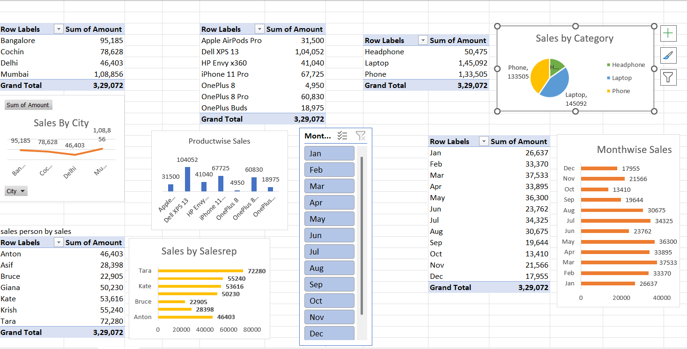
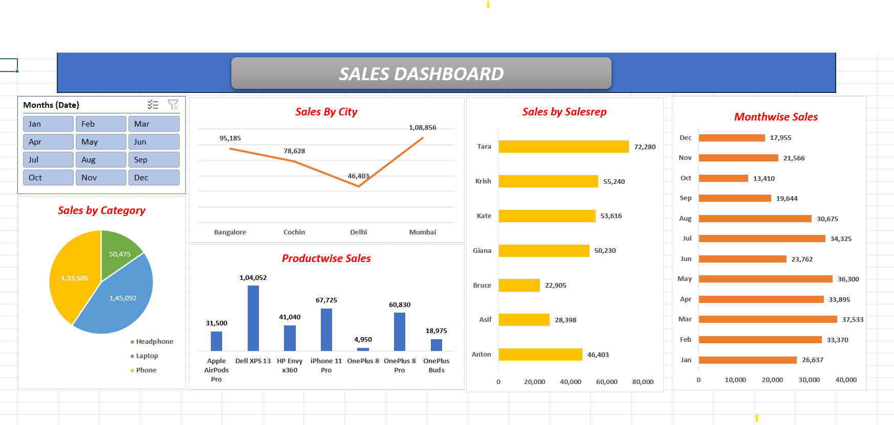

# 📊 Interactive Sales Performance & Regional Analysis Dashboard

## 📝 Project Overview
This project demonstrates an end-to-end data analytics workflow using Microsoft Excel. It transforms unstructured raw transaction log data into a clean, structured data model and aggregates it via Pivot Tables to drive an executive-level interactive analytical dashboard. 

The primary goal is to provide deep insights into product category performance, sales agent efficiency, and regional market distribution channels.

---

## 🛠️ Key Skills & Technologies Used
- **Advanced Excel**: Core data infrastructure, dynamic dashboards.
- **Power Query (ETL)**: Automated extraction, complex structural transformation, and systematic cleaning routines.
- **Data Modeling & Pivot Tables**: Cross-dimensional matrix summaries and custom calculated fields.
- **Data Visualization**: Dynamic Pivot Charts, contextual formatting, and responsive Slicers for granular filtering.

---

## 🧼 Step-by-Step Implementation Workflow

### 1. Data Extraction & Transformation (Power Query ETL)
The initial dataset was heavily unformatted, containing mixed casing, trailing whitespace anomalies, and data alignment discrepancies. The following transformations were implemented inside Power Query:
- **Text Standardization**: Cleaned string anomalies across core identifier dimensions (`FirstName`, `LastName`) using `TRIM`, `CLEAN`, and systematic text casing (`Capitalize Each Word`).
- **Data Formatting**: Enforced strict data types for financial vectors (`BaseSalary`, `MonthlySales` to Currency fields) and chronological vectors (`HireDate` to standard standard Date format).
- **Missing Value Resolution**: Validated empty rating cells and operational overhead records using validation checks to prevent skewing statistical aggregations.

### 2. Analytical Layer (Pivot Tables)
Using the clean structural model, analytical matrices were generated to slice historical parameters:
- **Revenue Distribution Table**: Aggregated total volumes grouped by operational markets and targeted categories.
- **Operational Performance Table**: Structured ranking matrices evaluating regional performance criteria based on quantitative thresholds.
- #### 📊 Pivot Table Architecture Preview:


### 3. Visual Dashboard Layer & Interactivity
The raw tables were mapped into an executive presentation layout:
- Combined multiple thematic **Pivot Charts** into a unified, clean viewport template grid.
- Connected cross-functional **Slicers** across the independent modules, enabling asynchronous slicing across regions, periods, and categories instantly.

---

## 📈 Dashboard Preview
Below is the visual layout of the functional business intelligence dashboard built within Excel:



---

## 📂 Repository Structure & Navigation
```text
├── README.md                                 # Executive project documentation & analysis outline
├── stepbystep.xlsx                           # The core interactive Excel Workbook housing the model & dashboard
└── dashboard_preview.png                     # Visual snapshot of the working dashboard system
